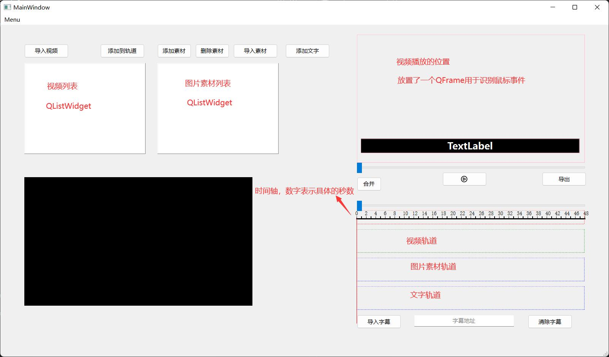
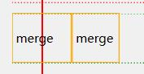
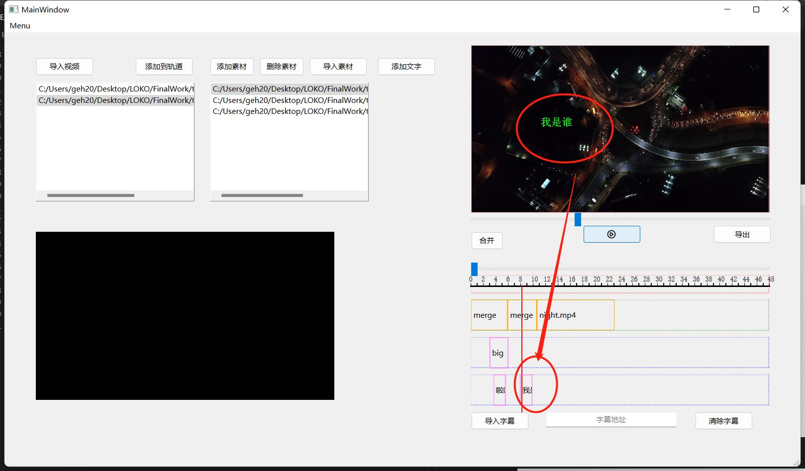
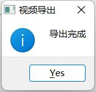

## **程序模块简介**
- ffmpeg.h
  - 利用QProcess调用ffmpeg.exe的封装接口
  - toPicture:将视频转化为图片存储到本地
  - connect:将图片连接成视频,参数可以设置码率、分辨率、格式
- info.h
  - struct videoInfo
    - 内含由视频图片帧的本地路径组成的QStringList
  - struct subText
    - 存储一句字幕的开始时间begin结束时间end以及对应的文字QString
  - enum tools
    - 表示当前的工具是clip还是Pick,只有clip模式可以对视频进行切分
- infodialog.h
  - 在pick模式下点击视频对应的QLabel会弹出的一个窗口
  - 可以对视频Label进行前后移动等
- fileop.h
  - 与文件处理相关的接口
  - DeleteFileOrFolder:删除路径对应的文件或者文件夹
  - fromSrt:将sr文件转为txt文件,读取内容并返回QList<subText*>
  - toTextList:将QList<subText*>按照25帧率转为QStringList
- getduration.h
  - 利用ffmpeg的库函数读取本地视频的时长
  - 用于确定视频对应QLabel的物理长度
- tupiandialog.h
  - 导入图片素材时弹出的Dialog,设置特效和图片的位置
- doubledialog.h
  - 添加文字弹出的一个Dialog(双击视频或者添加文字按钮)
  - 设置文字的位置以及
- outdialog.h
  - 导出视频时弹出的Dialog,设置格式、分辨率、码率
## **程序运行流程**

- 程序启动时构造函数中
  - 建立sources文件夹用于放置视频图片帧等文件
- eventPaint
  - QPainter画时间轴
  - 画竖直的红色刻度针
- 全局变量
  - picList:当前视频轨道的所有视频帧的list
  - index:当前帧下标
  - curPos:当前刻度针所在位置
- QTimer
  - 周期40ms(视频播放为1秒25帧)
  - 每次都index++，切换图片帧
  - this->update用于更新QPainter画的刻度针位置
- 导入视频clicked
  - 弹出选择文件对话框,选择视频文件
  - 调用ffmpeg.h中的toPicture函数将视频分割成图片帧并存储在sources文件夹
  - 新建QStringList存储图片帧对应的地址
  - 建立一个map连接视频地址和对应的图片帧
  - 将视频地址添加到视频列表中(QListWdiget.addItem)
- 添加到轨道
  - 调用getduration.h中的getDura函数获得视频的时长
  - 新建QLabel放置在视频轨道处
  - QLabel的物理长度与视频时长成正比
  - QLabel安装事件过滤器
  - 通过视频列表的map获得视频地址对应的图片帧地址QStringList
  - 建立map连接QLabel和对应的图片帧地址QStringList
- 添加素材
  - 弹出选择文件对话框,选择图片素材
  - 将地址加到图片列表(QListWdiget.addItem)
- 删除素材
  - 删除当前选中的素材(QListWidget.remove...)
- 导入素材
  - 弹出对话框选择位置x,y(标准大小为1920:1080)
  - 选择特效(fade-淡入淡出 bigger-变大 move-移动 no-无特效)
  - 选择持续时间t(单位为秒)
  - 要处理的图片帧为下标从index到index+25*t的picList中的图片
  - 新建透明QImage，将当前视频帧画上去，将图片素材画上去，然后这个QImage保存替换原来的视频帧
  - 特效的原理就是在画图片的时候可以按时间改变它的大小、位置和透明度
  - 新建QLabel放置在图片素材轨道
- 添加文字
  - 可以点击添加文字按钮或者双击视频位置
  - 弹出添加文字的对话框
  - 设置文字的位置坐标和文字内容
  - 选择持续的时间t
  - 新建透明QImage，将图片帧画上去，将文字画上去，QImage保存替换原来的视频帧
  - 新建QLabel放置在文字轨道
- 导入字幕
  - 弹出文件选择框
  - 选择srt文件
  - 调用fileop.h中的fromsrt和toTextlist将srt文件按照25帧的间隔转换为QStringlist
  - 从头开始处理视频帧
  - 每一帧都画上字幕对应的文字
  - 保存替换原来的视频帧
- 导出
  - 弹出导出视频的对话框
  - 设置格式、分辨率、码率
  - 调用ffmpeg.h中的connect函数将图片连成视频
- 事件过滤器
  - 安装时间过滤器的有视频对应的QLabel和视频播放位置的QFrame
  - QFrame重写双击事件用于添加文字
  - QLabel重写左键单击和右键单击事件
    - 左键单击
      - 如果当前工具为clip那就将视频切分为两块
      - 如果为pick弹出对话框用于QLabel的移动等
    - 右键单击
      - 删除当前QLabel
## **程序演示**
- **写在前面**
  - 录制了一个视频可供参考[参考视频](resources/demo.mp4)
  - 每次操作之前都播放一下再暂停(播放刷新picList)
  - 暂停之后再进行操作为了避免进程阻塞导致程序崩溃
  - 每次操作之后一定要等待鼠标放在按钮上有响应,不要点击,否则windows会提示程序无响应提示你关闭
  - 有两个slider进度条,只有上面那个是有效的,下面那个是摆设
  - 暂停模式下拖动进度条的时候画面不会实时刷新,再次点击播放时画面才会刷新
  - 播放模式下拖动进度条画面会实时刷新
- 双击可执行文件bin/videoCut/videoCut.exe
  - 可能打不开,出现以下对话框
  
  
  - 将bin/videoCut/ffmpeg/bin添加到系统环境变量即可
- bin同级目录下的test文件夹内是待演示的资源
  - video内有两个12秒视频
  - picture内有四个图片素材
  - zimu.srt是字幕文件
- 导入视频
  - 点击导入视频,选择test/video/daytime.mp4
  - 等待几秒钟直到鼠标放在按钮上有响应
  - 再次点击导入视频,选择test/video/night.mp4
  - 等待几秒钟直到鼠标放在按钮上有响应
  
- 添加到轨道
  - 选中第一个视频，点击添加到轨道
  - 选中第二个视频，点击添加到轨道
  - 
  - 点击播放按钮可以正常播放
- 合并
  - 点击合并按钮
  -  
- 切分
  - 点击左上角菜单选择clip(快捷键Ctrl+C)
  - 
  - 在视频的Label上左键点几下
  - 
- 移动
  - 菜单选择pick(快捷键Ctrl+P)
  - 左键点击视频QLabel
  - 
  - 点击forward或者backword可以前后移动视频QLabel
  - 默认移动个数为1
  - 也可以输入整数多移动几个
- 删除
  - 直接在视频Label上右键
  - 
- 现在视频很短，再选择一个视频添加到轨道
- 
- 添加素材
  - 点击添加素材按钮
  - 将test/picture中的四个图片依次添加到图片列表
  - 
- 删除素材
  - 选中一个素材
  - 点击删除素材
  - 
- 导入素材
  - 将进度条拖动到想要添加的位置
  - 选中一个素材,点击导入素材
  - 设置坐标x,y和持续时间t,选择一个特效
  - 
  - 等待几秒钟直到鼠标放在按钮上有响应
  - 再点击播放按钮就可以看到了
  - 
- 添加文字按钮
  - 点击添加文字按钮
  - 设置坐标和持续时间以及要添加的文字
  - 
  - 等待几秒钟直到鼠标放在按钮上有响应
  - 点击播放按钮就可以看到了
  - 
- 双击添加文字
  - 双击视频播放的位置
  - 程序会自动识别当前鼠标位置
  - 只需要设置持续时间和文字
  - 等待几秒钟直到鼠标放在按钮上有响应
  - 
- 添加字幕
  - 点击添加字幕按钮
  - 选择test/zimu.srt
  - **等待30秒钟**
  - 由于此时我直接将所有字幕贴在了视频帧上，所以消耗的时间会比较长
  - 直到这个lineEdit中的内容“字幕地址”发生了变化
  - 
  - 
- 导出
  - 点击导出按钮
  - 设置码率、分辨率、格式
  - 
  - **等待30秒钟**
  - 直到QMessageBox提示导出成功
  - 
  - 导出后的视频在bin/videoCut/resources/output.mp4
  - 
  - 注意:这个resources文件夹是在程序的构造函数中建立的，也就是说每次程序刚启动的时候都会重新建立resources文件夹，而之前已经存在的会被覆盖